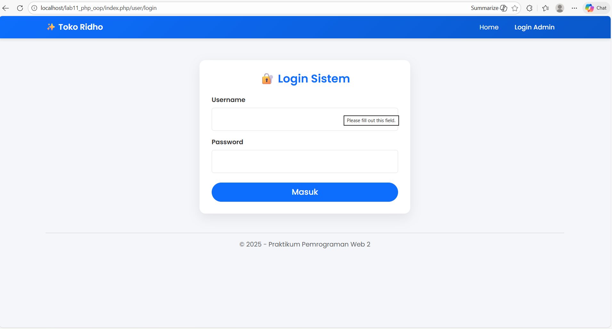
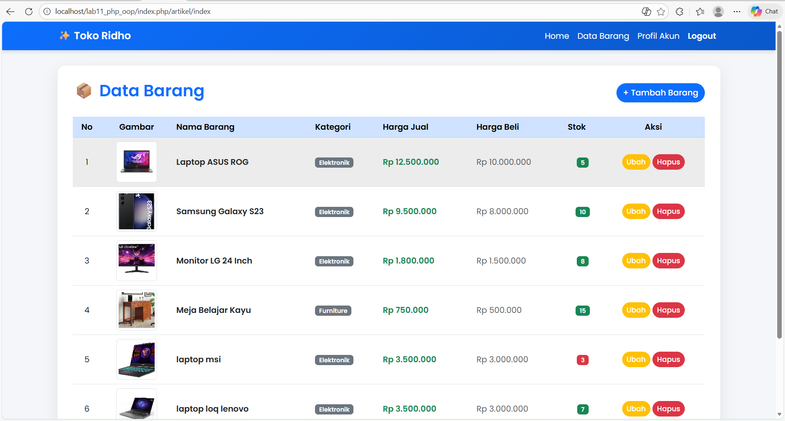
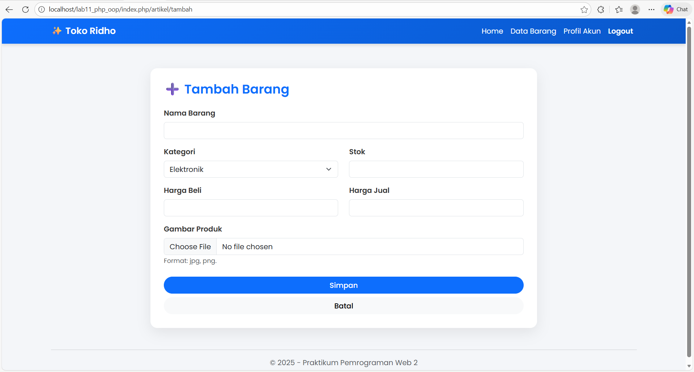
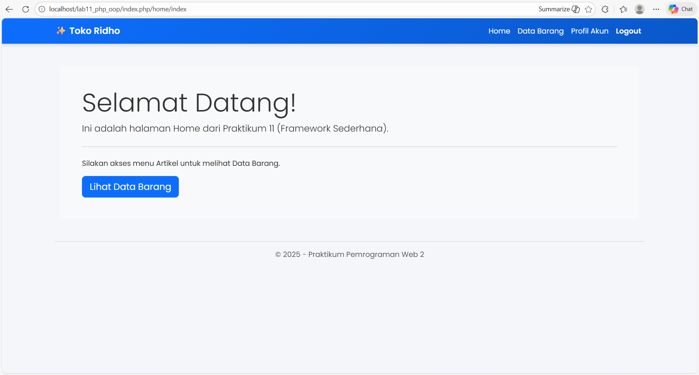
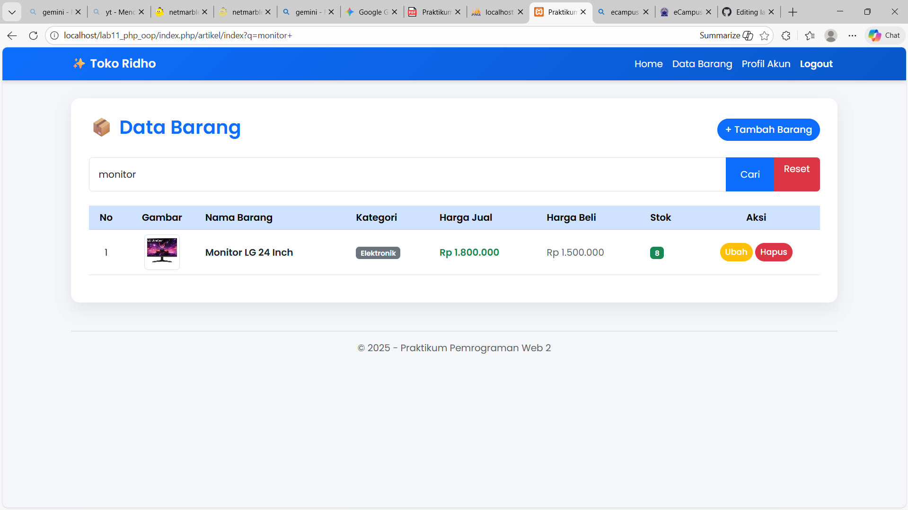
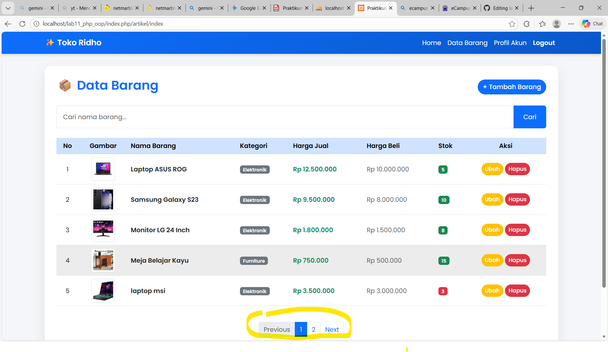

# lab11web
# 🚀 Lab11Web: Custom PHP MVC Framework


> **Repositori ini berisi implementasi Framework PHP modular sederhana yang dibangun dari nol (from scratch) menggunakan konsep OOP (Object-Oriented Programming) dan pola arsitektur MVC (Model-View-Controller).**

Proyek ini dikembangkan sebagai bagian dari tugas **Praktikum Pemrograman Web 2** untuk mendemonstrasikan pemahaman mendalam tentang routing, manajemen database, autentikasi pengguna, dan keamanan aplikasi web.

---

## 👨‍💻 Informasi Pengembang

| Atribut | Keterangan |
| :--- | :--- |
| **Nama** | **M.Ridho Febrian** |
| **NIM** | 312410500 |
| **Kelas** | TI.24.A.5 |
| **Universitas** | Universitas Pelita Bangsa |
| **Mata Kuliah** | Pemrograman Web 1 |

---

## 🌟 Fitur Utama (Key Features)

Aplikasi ini dirancang untuk mensimulasikan cara kerja framework modern dengan fitur-fitur berikut:

### 1. Arsitektur MVC & Custom Routing
Aplikasi tidak diakses secara langsung per file, melainkan melalui satu pintu gerbang (**Single Entry Point**) di `index.php`.
* **Routing Manual:** URL diproses untuk menentukan *Module* dan *Action* mana yang harus dijalankan (contoh: `/artikel/tambah`).
* **Modular:** Kode dipisah menjadi `Model` (Database/Class), `View` (Template), dan `Controller` (Logika Module).

### 2. Autentikasi & Keamanan (Security)
* **Session Management:** Membatasi akses halaman admin menggunakan PHP Session. Pengguna tanpa sesi aktif akan dialihkan paksa (*redirect*) ke halaman login.
* **Password Hashing:** Password pengguna **TIDAK** disimpan dalam teks biasa (*plain text*), melainkan dienkripsi menggunakan algoritma `password_hash()` (Bcrypt) untuk keamanan maksimal.
* **Access Control:** Proteksi halaman CRUD agar tidak bisa diakses lewat URL langsung (Bypassing).

### 3. Manajemen Data & Media (CRUD)
* **Create, Read, Update, Delete:** Manajemen data barang yang lengkap.
* **Image Upload:** Mendukung unggah gambar produk yang disimpan secara fisik di direktori server dan dicatat jalurnya (*path*) di database.

### 4. Manajemen Akun (User Profile)
* **Profil Admin:** Menampilkan informasi pengguna yang sedang login.
* **Ubah Password:** Fitur mengubah kata sandi dengan validasi keamanan enkripsi baru.

### 5. Pencarian & Navigasi Data (Search & Pagination)
* **Live Search:** Fitur pencarian data barang menggunakan query `LIKE` SQL.
* **Pagination:** Memecah tampilan data menjadi beberapa halaman (paging) menggunakan `LIMIT` dan `OFFSET` agar website tetap ringan meski data berjumlah banyak.

---

## 📂 Struktur Direktori (Architecture)

Struktur folder dirancang agar rapi, terorganisir, dan mudah dikembangkan (*scalable*) sesuai standar MVC:

```text
lab11_php_oop/
├── class/              # (Model & Libraries)
│   ├── Database.php    # Wrapper Koneksi & Query MySQLi
│   └── Form.php        # Helper untuk generate elemen form HTML
│
├── config.php          # Konfigurasi Database User/Pass
├── index.php           # (Router) Gerbang Utama Aplikasi
│
├── template/           # (View Layouts)
│   ├── header.php      # Navigasi, Meta Tag, CSS
│   └── footer.php      # Script JS & Copyright
│
├── module/             # (Controllers/Modules)
│   ├── home/           # Halaman Depan (Public)
│   ├── artikel/        # CRUD Data Barang (Protected)
│   │   ├── index.php   # Tampilan Tabel
│   │   ├── tambah.php  # Form Input & Upload
│   │   └── ...
│   └── user/           # Autentikasi User
│       ├── login.php   # Halaman Login
│       ├── logout.php  # Proses Destroy Session
│       └── profile.php # Halaman Ganti Password
│
└── img/                # Direktori Penyimpanan Aset Gambar
```
---

📸 Dokumentasi Aplikasi (Screenshots)
Berikut adalah antarmuka aplikasi yang telah dibangun:

## 1. Halaman Login (Authentication)
Gerbang keamanan sistem. Validasi username dan password terenkripsi.


## 2. Dashboard Data Barang (Read)
Menampilkan daftar barang dengan desain kartu (Card) modern dan tabel responsif.


## 3. Form Tambah & Upload (Create)
Input data barang termasuk fitur upload gambar produk.


## 4. Profil Pengguna (User Management)
Halaman untuk melihat info akun dan mengubah password admin.


## 5. halaman home 


## 6. halaman ubah barang/data


## 7. Fitur Pencarian


## 8. Fitur Pagination


⚙️ Instalasi & Penggunaan
Ikuti langkah ini untuk menjalankan proyek di komputer lokal (Localhost):

Clone Repository

Bash

git clone [https://github.com/username-kamu/Lab11Web.git](https://github.com/username-kamu/Lab11Web.git)
Konfigurasi Database

Buat database baru di phpMyAdmin bernama latihan1_oop.

Import file SQL atau buat tabel users dan data_barang.

Sesuaikan file config.php dengan user/password MySQL kamu.

```
Akun Demo (Admin) Gunakan akun berikut untuk masuk:

Username: admin

Password: admin123
```
Jalankan Aplikasi Buka browser dan akses: http://localhost/Lab11Web/

🧠 Penjelasan Teknis (Code Snippet)
Mekanisme Routing (index.php)
Ini adalah "otak" dari framework ini. Kode ini menangkap URL dan menentukan file mana yang harus dipanggil.

```PHP

// Menangkap request URL
$mod = $_GET['mod'] ?? 'home';
$page = $_GET['page'] ?? 'index';

// Teknik Fallback untuk Server Local (XAMPP)
if (isset($_SERVER['PATH_INFO'])) {
    $path = trim($_SERVER['PATH_INFO'], '/');
    $segments = explode('/', $path);
    if (count($segments) >= 2) {
        $mod = $segments[0];
        $page = $segments[1];
    }
}

// Memanggil modul yang sesuai
include "module/{$mod}/{$page}.php";
```
